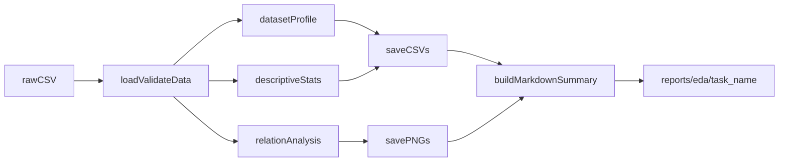

# Plan de EDA para ambos datasets (sueño + apnea)

## Objetivo claro de la etapa

Definir y ejecutar una etapa de **Entendimiento y Exploración (EDA)** sobre EEG de un canal para ambos problemas, con un pipeline reproducible que:

- caracterice estructura y calidad de los datos,
- describa distribución y forma de variables (tendencia central, dispersión, skewness, kurtosis),
- evalúe relaciones entre variables y con las etiquetas,
- exporte resultados listos para tu informe final.

**Criterio de éxito:** al finalizar, cada dataset tendrá un paquete EDA con tablas, gráficos y resumen narrativo en `reports/eda/...`, suficiente para sustentar decisiones de preprocesamiento/modelado.

## Alcance técnico y diseño

Aprovechar la estructura existente del template (`[C:\Users\Steven\University\2026\DataScience\FinalProjectTemplate\src\main.py](C:\Users\Steven\University\2026\DataScience\FinalProjectTemplate\src\main.py)`, `[C:\Users\Steven\University\2026\DataScience\FinalProjectTemplate\src\pipeline.py](C:\Users\Steven\University\2026\DataScience\FinalProjectTemplate\src\pipeline.py)`) y separar el EDA como módulo dedicado.

Flujo propuesto:

## Outputs para el informe (por dataset)

En `reports/eda/sleep_staging/` y `reports/eda/apnea_detection/` generar:

- `01_dataset_profile.csv`: filas/columnas, tipos, missing por variable, cardinalidad.
- `02_descriptive_numeric.csv`: mean, median, mode, std, var, min, max, range, IQR, skewness, kurtosis.
- `03_descriptive_categorical.csv`: frecuencias y proporciones por categoría.
- `04_correlations.csv`: matriz de correlación (Pearson y opcional Spearman en segundo archivo).
- `fig_hist_<feature>.png` (top N variables numéricas).
- `fig_box_<feature>.png` (detección visual de outliers).
- `fig_corr_heatmap.png` (correlaciones).
- `fig_target_distribution.png` (balance de clases por tarea).
- `eda_summary.md`: interpretación breve (hallazgos, sesgos, calidad de datos, implicaciones para modelado).

## Cambios de código propuestos

- Añadir módulo nuevo `[C:\Users\Steven\University\2026\DataScience\FinalProjectTemplate\src\eda.py](C:\Users\Steven\University\2026\DataScience\FinalProjectTemplate\src\eda.py)` con funciones:
  - `build_dataset_profile(df)`
  - `compute_descriptive_tables(df)`
  - `compute_correlations(df, numeric_cols)`
  - `generate_plots(df, target_col, output_dir, top_n=15)`
  - `write_markdown_summary(...)`
- Extender CLI en `[C:\Users\Steven\University\2026\DataScience\FinalProjectTemplate\src\main.py](C:\Users\Steven\University\2026\DataScience\FinalProjectTemplate\src\main.py)` para modo EDA:
  - `--task {sleep,apnea}`
  - `--target-col <col>`
  - `--eda-outdir reports/eda/<task>`
  - `--run-eda` (flag)
- Mantener `preprocess_dataframe` existente en `[C:\Users\Steven\University\2026\DataScience\FinalProjectTemplate\src\pipeline.py](C:\Users\Steven\University\2026\DataScience\FinalProjectTemplate\src\pipeline.py)` y encadenarlo antes del EDA (limpieza base + análisis).
- Añadir pruebas en `[C:\Users\Steven\University\2026\DataScience\FinalProjectTemplate\tests\test_pipeline.py](C:\Users\Steven\University\2026\DataScience\FinalProjectTemplate\tests\test_pipeline.py)` o nuevo `[C:\Users\Steven\University\2026\DataScience\FinalProjectTemplate\tests\test_eda.py](C:\Users\Steven\University\2026\DataScience\FinalProjectTemplate\tests\test_eda.py)` para validar creación de tablas/figuras/markdown.
- Actualizar dependencias en `[C:\Users\Steven\University\2026\DataScience\FinalProjectTemplate\requirements.txt](C:\Users\Steven\University\2026\DataScience\FinalProjectTemplate\requirements.txt)`: `matplotlib`, `seaborn`, `scipy` (para skewness/kurtosis robustas).

## Convención de ejecución (reproducible)

- Sueño:
  - `python src/main.py --input data/raw/<sleep_file>.csv --output data/processed/sleep_clean.csv --run-eda --task sleep --target-col <sleep_stage_col> --eda-outdir reports/eda/sleep_staging`
- Apnea:
  - `python src/main.py --input data/raw/<apnea_file>.csv --output data/processed/apnea_clean.csv --run-eda --task apnea --target-col <apnea_label_col> --eda-outdir reports/eda/apnea_detection`

## Riesgos y mitigación

- Nombres de columnas objetivo distintos entre datasets: parametrizar `--target-col`.
- Muchas variables o alta dimensionalidad: limitar gráficos a top N variables numéricas por varianza/missing bajo.
- Variables no numéricas codificadas como texto: coerción controlada y reporte explícito de conversiones fallidas en `eda_summary.md`.

