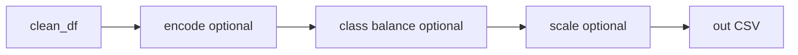

# Plan: equilibrio de clases (Topic 11, cualquier dataset)

## Referencia

[`.cursor/knowledge/DataScienceTopics.md`](.cursor/knowledge/DataScienceTopics.md) **Topic 11**: submuestreo mayoritario, sobremuestreo minoritario (p. ej. SMOTE), cost-sensitive learning, métricas adecuadas (F1, AUC-PR, evitar accuracy como única métrica), estratificación en splits, etc.

## Alcance técnico (SRP)

Nuevo módulo dedicado **[`src/class_balance.py`](src/class_balance.py)** (nombre claro para el informe):

| En el módulo | Fuera del módulo (solo documentado en informe) |
|--------------|--------------------------------------------------|
| Remuestreo de filas según columna objetivo | Entrenamiento con Balanced RF / EasyEnsemble |
| SMOTE en espacio numérico | Recolectar más datos |
| Cálculo de `class_weight` estilo sklearn a partir de conteos | Ajuste fino de costes por negocio |
| Informe Markdown: distribución antes/después + texto Topic 11 (métricas, stratify, costes) | Curvas PR/ROC (requieren predicciones) |

Así el paso es **reutilizable en cualquier CSV tabular**: basta indicar la columna objetivo (categórica o binaria codificada como texto/números discretos) y el método.

## Dependencias

Hoy [`requirements.txt`](requirements.txt) no incluye sklearn. **SMOTE** y API homogénea recomendada:

- Añadir **`imbalanced-learn`** (arrastra **`scikit-learn`** como dependencia).

Remuestreo aleatorio podría hacerse solo con pandas; usar **`RandomUnderSampler` / `RandomOverSampler`** de imbalanced-learn mantiene una sola API, `sampling_strategy` compatible con SMOTE y menos código duplicado.

## Diseño de API

- **`BalanceMethod`**: `none` | `random_under` | `random_over` | `smote`.
- **`ClassBalanceOptions`** (dataclass):
  - `target_column: str` (nombre ya alineado con `snake_case` como en el resto del pipeline).
  - `method: BalanceMethod`.
  - `random_state: int` (default fijo, p. ej. 42).
  - `sampling_strategy: str | float | dict | None` — passthrough a imbalanced-learn (`"auto"`, ratio, dict por clase); default `"auto"` donde aplique.
- **`ClassBalanceReport`**: conteos por clase antes/después, método, filas in/out, advertencias (p. ej. clases con muy pocas muestras para SMOTE).
- **`balance_dataframe(df, options) -> Tuple[pd.DataFrame, ClassBalanceReport]`**:
  - Si `method == "none"`: devolver copia y reporte vacío.
  - Separar `X` (todas las columnas excepto `target`) e `y` (`df[target]`).
  - **`random_under` / `random_over`**: `fit_resample` con imblearn; reconstruir `DataFrame` con mismos nombres de columnas y tipos razonables.
  - **`smote`**: exigir que **todas las columnas de `X` sean numéricas**; si no, `ValueError` claro (“codifica antes con `encoding.py` o deja solo features numéricas”). SMOTE no admite NaN en features: el pipeline actual ya imputa en limpieza; documentar en docstring.
  - **Multiclase**: soportado por imbalanced-learn con las mismas clases.
- **`compute_class_weights_for_cost_sensitive(y: pd.Series) -> Dict[Any, float]`**: fórmula inversa a frecuencia (`n_samples / (n_classes * count)` por clase) para usar en `class_weight` de sklearn — encaja con Topic 11 “cost-sensitive learning” sin acoplar a un modelo concreto.
- **`write_class_balance_report(path, report, options, class_weights: Optional[dict])`**: Markdown con tablas de conteos, método, y sección “Recomendaciones Topic 11” (métricas, stratified split, costes a nivel modelo).

**Alineación de nombres**: función **`align_balance_options_to_snake_case`** (misma idea que [`encoding.py`](src/encoding.py) / [`scaling.py`](src/scaling.py)) para que JSON/CLI usen cabeceras crudas del CSV.

## Integración en [`src/main.py`](src/main.py)

Orden propuesto (SMOTE en espacio numérico; remuestreo aleatorio no exige numérico puro):

- Nuevos flags: `--balance-method`, `--balance-random-state`, opcional `--balance-strategy` (string JSON o literal simple documentado), `--write-class-balance-report`, `--class-balance-outdir`.
- Opcional: claves en el mismo JSON que `--encoding-spec` (p. ej. `class_balance_method`, `sampling_strategy`) leídas con `load_spec_json` y fusionadas con CLI (CLI gana si `--balance-method` ≠ `none`, análogo a escalado).
- **`--target-col`** obligatorio cuando `balance-method` ≠ `none`.

## Pruebas [`tests/test_class_balance.py`](tests/test_class_balance.py)

- DataFrame binario desbalanceado: `random_under` reduce mayoría; `random_over` aumenta minoría; conteos coherentes.
- DataFrame solo numérico + target: `smote` aumenta filas minoritarias.
- Error claro si SMOTE con columna objeto en `X`.
- `compute_class_weights_for_cost_sensitive` suma/proporciones razonables.

## Documentación

- Actualizar [`README.md`](README.md): árbol con `class_balance.py`, orden del pipeline, ejemplo mínimo de CLI y nota Topic 11 (métricas / `class_weight` / stratify al entrenar).

## Archivos

- **Nuevo:** [`src/class_balance.py`](src/class_balance.py), [`tests/test_class_balance.py`](tests/test_class_balance.py).
- **Editar:** [`requirements.txt`](requirements.txt), [`src/main.py`](src/main.py), [`README.md`](README.md).

## Riesgos

- SMOTE con **muy pocas** muestras minoritarias (`k_neighbors`): imblearn puede fallar — capturar excepción o validar `value_counts()` y mensaje útil.
- **Sintéticos + interpretación**: el informe debe aclarar que SMOTE genera filas sintéticas para entrenamiento, no para sustituir EDA sobre datos reales.
