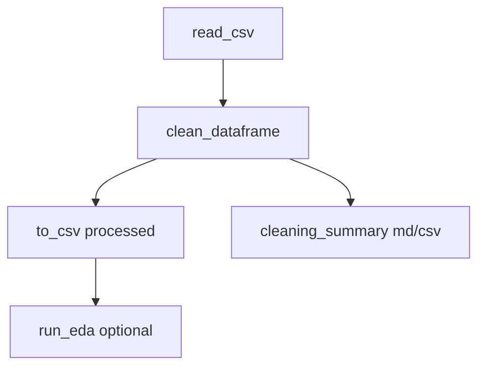

# Plan: Limpieza de datos (Topic 1 + salidas EDA)

## Contexto actual

- **[`src/pipeline.py`](src/pipeline.py)** ya implementa parte de la limpieza: nombres de columnas en `snake_case`, eliminación de filas totalmente vacías (`dropna(how="all")`), `drop_duplicates()` global, e **imputación** mediana (numéricas) y moda (objeto). El informe solo expone conteos vía [`PipelineReport`](src/pipeline.py) (filas in/out, vacías, duplicados).
- **[`src/eda.py`](src/eda.py)** produce lo que el guía Topic 1 pide para *antes* de modelar: perfil con **missing** ([`build_dataset_profile`](src/eda.py)), estadísticas con **IQR** (base para outliers) y **boxplots** por variable numérica ([`generate_plots`](src/eda.py)), más skewness/kurtosis en el resumen.
- **[`.cursor/knowledge/DataScienceTopics.md`](.cursor/knowledge/DataScienceTopics.md)** Topic 1: EDA incluye missing y outliers; Topics 3–5: IQR robusto frente a outliers, skewness/kurtosis, y que la **estandarización** suele preferirse cuando hay outliers frente a min-max.

La limpieza debe **cerrar el ciclo**: las decisiones deben poder justificarse con `01_dataset_profile.csv`, `02_descriptive_numeric.csv` y las figuras `fig_box_*`.

## Diseño propuesto

### 1. Informe y trazabilidad de limpieza

- Ampliar o reemplazar `PipelineReport` por un objeto de informe más rico (p. ej. `CleaningReport` o extensión compatible) que registre, como mínimo:
  - conteos de missing **por columna antes** de imputar (o referencia a que el perfil EDA ya lo documenta si el orden del pipeline es: carga → limpieza → CSV procesado → EDA sobre limpio);
  - duplicados eliminados (ya existe);
  - reglas de **outliers**: método (p. ej. Tukey 1.5×IQR por columna), umbral, cuántas filas/celdas afectadas, acción aplicada (ver abajo);
  - conversiones de inconsistencias (columnas coercionadas, categorías unificadas).
- Exportar opcionalmente **`reports/cleaning/<task>/cleaning_summary.md`** y/o **`cleaning_log.csv`** para el informe académico (misma filosofía que EDA).

**Orden del flujo recomendado** (coherente con [`main.py`](src/main.py)): lectura CSV → **limpieza estructurada** (incl. outliers si aplica) → guardar `data/processed/*.csv` → si `--run-eda`, EDA sobre el dataframe ya limpio (el EDA actual describe el estado *post-limpieza*, lo cual es válido si el markdown de limpieza explica qué se hizo antes).

### 2. Valores faltantes

- **Mantener** imputación mediana/mod como línea base para features tabulares de EEG (robusta frente a outliers en numéricas, coherente con Topic 3).
- **Añadir** (según severidad detectada en perfil EDA):
  - opción de **excluir columnas** con missing por encima de un umbral configurable (p. ej. `--drop-cols-missing-pct 50`), documentando columnas eliminadas en el informe; o
  - para la columna **objetivo**, política explícita: eliminar filas con target faltante (si aplica al dataset real) en lugar de imputar — decisión crítica para aprendizaje supervisado.
- Documentar en el resumen de limpieza la **justificación** (Topic 1: entender missing antes de modelar): imputación simple vs eliminación según proporción y rol de la variable.

### 3. Duplicados

- Conservar `drop_duplicates()` sin subset como default.
- Si los CSV tienen **identificador de ventana/sujeto**, añadir parámetro opcional `--dedupe-subset col1,col2` para deduplicar por clave semántica (evitar duplicados “ocultos” que no son filas idénticas). Registrar en el informe qué subset se usó.

### 4. Inconsistencias

- Además de `to_snake_case` en columnas:
  - **Strings**: `strip()`, colapsar espacios, y normalización de categorías (p. ej. minúsculas o mapeo de sinónimos) en columnas objeto conocidas o en todas las no numéricas con cardinalidad baja.
  - **Numéricas mal parseadas**: donde aplique, `pd.to_numeric(..., errors="coerce")` seguido de conteo de `NaN` inducidos → imputación como el resto, con conteo en el informe (alineado con la nota del plan EDA sobre coerción).
- Evitar cambios masivos no justificados: limitar a patrones seguros o flags CLI.

### 5. Outliers (definición y acción)

- **Definición explícita en código y texto**: regla **Tukey** con IQR — mismos cuartiles que ya calcula [`compute_descriptive_tables`](src/eda.py): límites \(Q1 - 1.5 \times IQR\) y \(Q3 + 1.5 \times IQR\) por columna numérica seleccionada (excluir opcionalmente columnas ID o la target si es numérica incorrectamente).
- **Acción por defecto recomendada para features de EEG tabular**: **winsorización** (clip a los límites Tukey) o **transformación** (p. ej. `log1p` solo si la variable es estrictamente positiva y el EDA muestra skew fuerte), en lugar de borrar muchas filas — coherente con no destruir muestras escasas y con Topic 5 (outliers penalizan min-max).
- **Alternativa documentada**: eliminación de filas solo si se acota a columnas donde el outlier indique error de medición (política conservadora y justificada en el markdown).
- Exponer flags CLI, p. ej. `--outlier-method {none,tukey_winsorize}` y `--outlier-columns` opcional (default: todas las numéricas excepto lista de exclusión).

### 6. Integración en código

- Implementación preferible: **módulo dedicado** [`src/cleaning.py`](src/cleaning.py) (o refactor de [`src/pipeline.py`](src/pipeline.py) si se prefiere un solo archivo) con función principal `clean_dataframe(df, *, target_col, options) -> Tuple[pd.DataFrame, CleaningReport]` que [`preprocess_dataframe`](src/pipeline.py) delegue o reemplace.
- Actualizar [`src/main.py`](src/main.py) para pasar `--target-col` y nuevos flags a la limpieza cuando existan.
- **Pruebas**: [`tests/test_pipeline.py`](tests/test_pipeline.py) o nuevo `tests/test_cleaning.py` con DataFrames sintéticos: missing, duplicados, strings inconsistentes, valores fuera de IQR; aserciones sobre forma del dataframe y campos del informe.

## Diagrama de flujo

## Criterios de éxito

- El informe final puede describir **missing, duplicados, inconsistencias y outliers** con definición cuantitativa (IQR) y acción tomada, citando artefactos generados y enlazando con tablas/figuras EDA ya existentes.
- El pipeline sigue siendo reproducible por CLI y los tests cubren la nueva lógica sin romper [`tests/test_eda.py`](tests/test_eda.py).
