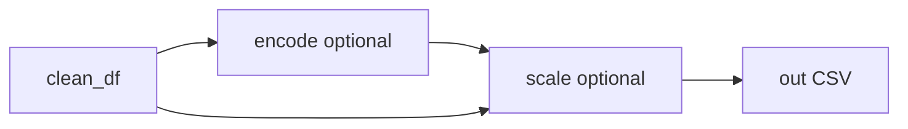

# Plan: módulo de escalado (Topic 5) y SRP

## Referencia conceptual

En [`.cursor/knowledge/DataScienceTopics.md`](.cursor/knowledge/DataScienceTopics.md) **Topic 5** distingue:

- **Normalización (min-max):** \(X' = (X - X_{min}) / (X_{max} - X_{min})\) → típicamente [0, 1]; adecuada cuando hay pocos outliers y se buscan magnitudes acotadas.
- **Estandarización (z-score):** \(X' = (X - \mu) / \sigma\) → media 0 y desvío 1; adecuada con outliers o supuestos tipo gaussianos en el modelo.

El código actual implementa ambas en [`src/encoding.py`](src/encoding.py) (`_scale_column`, líneas ~126–151) y las aplica dentro de `encode_dataframe` cuando `spec.numeric_scaling` está definido (líneas ~202–214), mezclando **Topic 1** (codificación categórica) con **Topic 5** (escala).

## Objetivo de diseño (SRP)

| Módulo | Responsabilidad |
|--------|-----------------|
| [`src/encoding.py`](src/encoding.py) | Solo categorías: nominal (one-hot), ordinal (enteros ordenados), binario (0/1). |
| **Nuevo** [`src/scaling.py`](src/scaling.py) | Solo transformación de escala numérica: `standardize` \| `minmax` por columna, con exclusiones. |

Flujo en [`src/main.py`](src/main.py):

- Si hay `--encoding-spec`, el escalado ocurre **después** de codificar (misma idea que hoy: dummies ya numéricas entran en el escalado salvo exclusiones).
- Si **no** hay encoding, el escalado puede aplicarse sobre `clean_df` solo con columnas numéricas.

## Implementación propuesta

### 1. Crear [`src/scaling.py`](src/scaling.py)

- Docstring que cite Topic 5 (fórmulas en línea con el knowledge).
- `ScaleMethod = Literal["standardize", "minmax"]`.
- `ScalingOptions` (dataclass): `method: ScaleMethod`, `exclude_columns: Tuple[str, ...]`, `target_column: Optional[str]` (nunca escalar; alineado con uso supervisado), opcional `include_columns: Optional[Tuple[str, ...]]` — si no es `None`, escalar **solo** esas columnas (mayor control en datasets genéricos).
- `scale_numeric_dataframe(df, options) -> Tuple[pd.DataFrame, ScalingReport]`:
  - Copia del dataframe.
  - Por cada columna candidata (numéricas vía `select_dtypes`), aplicar la misma lógica que hoy `_scale_column` (NaN preservados; `std` poblacional `ddof=0` como ahora; min-max con rango 0 si constante).
- `ScalingReport`: `method`, lista de columnas escaladas, quizá conteos de NaN ignorados.
- `write_scaling_summary(path, report, options)` (Markdown breve para informes).
- Helpers para **mismo JSON plano** que hoy mezcla encoding + scaling: `scaling_options_from_dict(data) -> Optional[ScalingOptions]` leyendo `numeric_scaling`, `scale_exclude`, `target_column` del objeto raíz; devuelve `None` si `numeric_scaling` es null/ausente.

`align_spec_to_snake_case` para opciones de escalado: reutilizar la misma convención que en encoding (función local `_to_snake_case` en `scaling.py` duplicada mínima, o importar solo si no rompe `pytest` con `src.scaling` — preferible duplicar 3 líneas como en encoding para evitar dependencias circulares / path issues).

### 2. Refactor [`src/encoding.py`](src/encoding.py)

- Eliminar `_scale_column` y el bloque de escalado en `encode_dataframe`.
- Quitar de `VariableEncodingSpec`: `numeric_scaling`, `scale_exclude`, `target_column` (este último solo servía al escalado en el spec actual).
- Quitar de `EncodingReport`: `scaled_numeric_columns`, `scaling_method`.
- Actualizar `variable_encoding_spec_from_dict` / `align_spec_to_snake_case` / `write_encoding_report` para no mencionar escalado.
- Ajustar docstring del módulo: solo Topic 1; referir a `scaling.py` para Topic 5.

**Compatibilidad JSON:** los campos `numeric_scaling`, `scale_exclude`, `target_column` pueden seguir existiendo en el mismo archivo que `nominal_columns` / `ordinal_columns`; [`load_variable_encoding_spec`](src/encoding.py) seguirá ignorándolos al construir `VariableEncodingSpec` (no pasan al dataclass). [`main.py`](src/main.py) hará `json.loads` una vez cuando exista `--encoding-spec`, construirá el spec de encoding **y** `ScalingOptions` desde el mismo dict vía `scaling_options_from_dict`.

### 3. Actualizar [`src/main.py`](src/main.py)

- Nueva función `step_scale_data(df, options: ScalingOptions | None, write_report, outdir, task_label) -> (df, report, paths)`; si `options` es `None`, devolver `df` sin cambios.
- Orden: `output_df = clean_df` → si encoding → `output_df = encoded` → **si hay opciones de escalado** (desde JSON o CLI) → `output_df = scaled`.
- Nuevos argumentos CLI (mínimos):
  - `--scale-method {none,standardize,minmax}` (default `none`).
  - `--scale-exclude` lista CSV de columnas (nombres en crudo; normalizar con `to_snake_case` de cleaning para coincidir con columnas limpias).
- Precedencia: si `--scale-method` ≠ `none`, usar CLI (y exclude CLI + `--target-col` añadido a exclude implícitamente). Si `--scale-method` es `none` y el JSON de `--encoding-spec` define `numeric_scaling`, usar eso **después** del encoding (y si no hubo encoding pero el usuario añade en el futuro un `--scaling-spec`, se puede reservar; para el plan basta JSON compartido + CLI).
- Caso **solo escalado sin encoding:** `--scale-method standardize` sobre `clean_df`.
- Opcional: `--write-scaling-report` y `--scaling-outdir` (default `reports/scaling/<task|default>/scaling_summary.md`).
- Actualizar descripción del argparse y mensajes de log (“Encoding finished” / “Scaling finished”).

### 4. Pruebas

- Nuevo [`tests/test_scaling.py`](tests/test_scaling.py): min-max [0,1] en columna simple; z-score media ~0; exclusión de target; constante → ceros; NaN preservados.
- Ajustar [`tests/test_encoding.py`](tests/test_encoding.py): eliminar `test_standardize_excludes_target` del módulo encoding (sustituir por test en `test_scaling`); asegurar que tests de one-hot/ordinal siguen pasando.
- Test de integración ligero opcional: dict JSON con encoding + `numeric_scaling` simulado en memoria y verificar orden encode → scale en una función de main o test de `scaling_options_from_dict` + dos pasos.

### 5. Documentación

- [`README.md`](README.md): añadir `scaling.py` al árbol; separar “Codificación” y “Escalado (Topic 5)”; ejemplo JSON indicando que `numeric_scaling` lo consume el paso de escalado, no el de encoding.

## Archivos tocados (resumen)

- **Nuevo:** [`src/scaling.py`](src/scaling.py), [`tests/test_scaling.py`](tests/test_scaling.py).
- **Editar:** [`src/encoding.py`](src/encoding.py), [`src/main.py`](src/main.py), [`tests/test_encoding.py`](tests/test_encoding.py), [`README.md`](README.md).

## Riesgos / notas

- **Ordinales y escalado:** escalar columnas ordinales (0,1,2) puede ser indeseable; el usuario debe listarlas en `scale_exclude` o usar `include_columns` cuando se exponga — documentar en docstring de `ScalingOptions`.
- **One-hot 0/1:** al escalar “todas las numéricas”, los dummies también se escalan (comportamiento equivalente al actual). Si se quisiera excluir dummies en el futuro, sería un flag adicional (fuera del alcance mínimo del plan).
