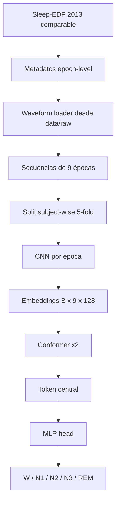

# Arquitectura CNN + Conformer para Sleep-EDF

Este documento describe la línea deep implementada para `sleep staging` con EEG monocanal sobre la variante comparable de `Sleep-EDF 2013`.

Parámetros base:

- canal: `Fpz-Cz`
- época: `30 s`
- protocolo: `subject-wise`
- secuencia de entrada: `9` épocas consecutivas
- target: clase de la época central
- runner: `scripts/run_phase_e_deep.py`

## 1. Pipeline implementado

```text
sleep_edf_2013_fpzcz_raw.csv
    -> metadatos de época: recording_id, subject_id, source_file, tiempos y label
    -> reconstrucción on-demand del waveform desde data/raw/
    -> secuencias de 9 épocas sin cruzar recording_id
    -> split subject-wise 5-fold
    -> entrenamiento supervisado (CNN o Conformer)
    -> opcional: pretraining SSL contrastivo + fine-tuning
    -> artefactos Fase E: metrics_per_fold.csv, summary.json, predictions/, figures/, models/
```

## 2. Vista general



## 3. Arquitectura propuesta

```text
Entrada por muestra
[B, 9, 3000]
9 épocas de 30 s a 100 Hz
predicción de la época central

        ┌─────────────────────────────┐
        │  Epoch Encoder compartido   │
        │  CNN 1D por época           │
        │  3000 -> embedding 128      │
        └──────────────┬──────────────┘
                       |
                       v
              [B, 9, 128] embeddings
                       |
                       v
        ┌─────────────────────────────┐
        │ Positional embedding        │
        │ + dropout 0.1               │
        └──────────────┬──────────────┘
                       |
                       v
        ┌─────────────────────────────┐
        │ Conformer Block x 2         │
        │ FFN -> MHSA -> Conv -> FFN  │
        │ d_model=128, heads=4        │
        │ ffn_dim=256                 │
        └──────────────┬──────────────┘
                       |
                       v
             Selección del token central
                    índice 4
                       |
                       v
        ┌─────────────────────────────┐
        │ MLP head                    │
        │ 128 -> 64 -> 5              │
        │ dropout 0.2                 │
        └──────────────┬──────────────┘
                       |
                       v
                W / N1 / N2 / N3 / REM
```

## 4. Descripción por bloque

### CNN por época

- Entrada por época: `3000` muestras
- `Conv1D(1 -> 32, kernel=50, stride=6)`
- `BatchNorm + ReLU + MaxPool`
- `Conv1D(32 -> 64, kernel=8)`
- `BatchNorm + ReLU + MaxPool`
- `Conv1D(64 -> 128, kernel=8)`
- `BatchNorm + ReLU + AdaptiveAvgPool`
- `Linear(128 -> 128)`

Rol:
- aprender rasgos locales del waveform
- capturar estructura morfológica y ritmos cortos
- producir un embedding compacto por época

### Conformer temporal

- embedding por época: `128`
- bloques: `2`
- cabezas de atención: `4`
- `FFN dim = 256`
- `dropout = 0.1`
- `conv kernel size = 31`

Rol:
- modelar contexto entre épocas vecinas
- incorporar transiciones de sueño
- mantener un costo razonable para hardware local

### Head de clasificación

- usa el token central de la secuencia
- `Linear(128 -> 64) -> ReLU -> Dropout -> Linear(64 -> 5)`

Rol:
- convertir el embedding contextualizado de la época central en logits de clase

## 5. Variante SSL ligera

La variante `Conformer + SSL` reutiliza exactamente el mismo encoder:

- dos vistas aumentadas de la misma secuencia
- `gaussian noise`
- `amplitude scaling`
- `time masking`
- `frequency dropout`
- cabeza de proyección `128 -> 128 -> 64`
- pérdida contrastiva tipo `NT-Xent`

Después del pretraining, el encoder se reutiliza para el `fine-tuning` supervisado.

## 6. Hiperparámetros iniciales

| Componente | Valor inicial |
|---|---|
| Canal | `Fpz-Cz` |
| Frecuencia objetivo | `100 Hz` |
| Muestras por época | `3000` |
| Longitud de secuencia | `9` épocas |
| Embedding por época | `128` |
| Conformer blocks | `2` |
| Attention heads | `4` |
| FFN interno | `256` |
| Dropout temporal | `0.1` |
| Head MLP | `128 -> 64 -> 5` |
| Loss | `CrossEntropy` con pesos por clase |
| Optimizer | `AdamW` |
| Learning rate inicial | `1e-4` |
| Batch size inicial | `8` |
| SSL projection dim | `64` |
| SSL temperature | `0.1` |

## 7. Matriz de comparación

La comparación formal prevista para `Sleep-EDF` es:

- `SleepEEGNet 2013`
- `SVM-RBF`
- `Random Forest`
- `XGBoost`
- `CNN`
- `Conformer`
- `Conformer + SSL`

Métricas obligatorias:

- `accuracy`
- `macro-F1`
- `kappa`
- `F1` por clase
- foco explícito en `N1`
- tiempo por epoch
- VRAM pico
- número de parámetros
- tamaño del checkpoint
